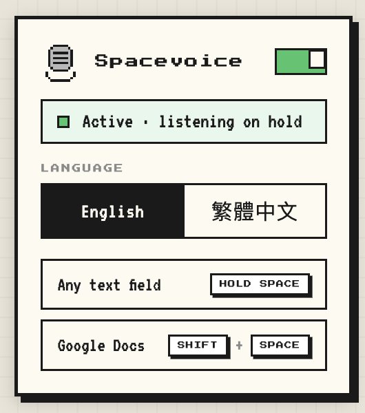

# Spacevoice

Chrome extension — hold **Space** to dictate into any text field. English + 繁體中文.

  

## Install

1. Open `chrome://extensions`, enable **Developer mode**.
2. **Load unpacked** → select this folder.

## Use

- Click into a text field, hold `Space`, speak, release.
- In Google Docs, use `Shift`+`Space` instead.
- Switch language from the popup.
